# InvestHub System Diagrams & Architecture
> **Architecture Style**: Single Page Application (SPA) / Modern Web App (Next.js)
> **Generated On**: 2026-02-12

This document contains comprehensive architectural diagrams for the **InvestHub** platform. The diagrams are defined using **Mermaid.js** syntax, which renders into visual charts.

---

## 1. System Context Diagram (DFD Level 0)

**Description**: High-level view of how users and external systems interact with InvestHub.

```mermaid
graph TD
    %% Actors
    User((Investor))
    Admin((Administrator))

    %% System Boundary
    subgraph InvestHub Platform
        Portal[InvestHub Web Application]
    end

    %% External Systems
    Razorpay[Razorpay Payment Gateway]
    EmailService[Email Provider (SMTP/Resend)]
    GoogleAuth[Google OAuth]

    %% Relationships
    User -->|Views Portfolio, Invests, Withdraws| Portal
    Admin -->|Manages Capital, Approves Withdrawals| Portal
    
    Portal -->|Initiates Payments, Verifies Webhooks| Razorpay
    Portal -->|Sends OTPs, Notifications| EmailService
    Portal -->|Authenticates Users| GoogleAuth
    
    Razorpay -->|Payment Status Updates (Webhook)| Portal
```

---

## 2. Container Architecture (C4 Level 2)

**Description**: Detailed breakdown of the application containers and technology choices.

```mermaid
graph TD
    %% Clients
    Browser[Web Browser (Client)]
    
    %% Server Side
    subgraph "Next.js Environment (Serverless)"
        Router[App Router (Server Components)]
        API[API Routes / Server Actions]
        Auth[NextAuth.js Handler]
        Services[Business Logic Layer]
    end

    %% Data Store
    DB[(MongoDB Database)]
    
    %% Flows
    Browser -- "HTTPS / JSON / RSC Payload" --> Router
    Browser -- "AJAX / Fetch API (Client Actions)" --> API
    
    Router -- "Queries Data" --> DB
    API -- "CRUD Operations" --> Services
    Services -- "Mongoose Models" --> DB
    
    Auth -- "Validates Session" --> DB
    Auth -- "OAuth Handshake" --> GoogleAuth[Google Identity]
```

---

## 3. Data Flow Diagram Strategy (DFD Level 1)

**Description**: Functional decomposition of the system's core processes.


---

## 4. Component Diagram

**Description**: Internal structure of the application logic modules.


---

## 5. Entity Relationship Diagram (ERD)

**Description**: The data schema and relationships between core entities.


---

## 6. Sequence Diagram: Deposit & Investment Flow

**Description**: The step-by-step process of a user adding funds and starting an investment.


---

## 7. Sequence Diagram: Withdrawal Request & Admin Approval

**Description**: The governance flow for moving funds out of the system.

```mermaid
sequenceDiagram
    actor User
    participant UI as Frontend
    participant API_W as /api/finance/withdraw
    participant API_A as /api/admin/withdraw
    participant Ledger as LedgerService
    actor Admin
    participant Email as EmailService

    %% User Request
    User->>UI: Request Withdrawal (e.g., ₹5000)
    UI->>API_W: POST /api/finance/withdraw {amount}
    
    API_W->>Ledger: Check Balance & Lock Funds
    alt Sufficient Balance
        Ledger->>DB: Wallet.profit -= 5000
        Ledger->>DB: Wallet.locked += 5000
        API_W->>DB: Create Withdrawal Request (PENDING)
        API_W-->>UI: Request Submitted
    else Insufficient Balance
        API_W-->>UI: Error: Insufficient Funds
    end

    %% Admin Approval
    Admin->>UI: View Pending Withdrawals
    Admin->>UI: Click "Approve" (Enter UTR: UTR123)
    
    UI->>API_A: POST /api/admin/withdraw/manage {id, action: "APPROVE", utr}
    
    API_A->>Ledger: Finalize Withdrawal
    Ledger->>DB: Wallet.locked -= 5000
    Ledger->>DB: Wallet.totalWithdrawn += 5000
    Ledger->>DB: Update Withdrawal -> APPROVED (with UTR)
    
    API_A->>Email: Send "Withdrawal Approved" Email to User
    API_A-->>UI: Success Message
```



---

## 8. Deployment Architecture

**Description**: Infrastructure topology for production deployment.

```mermaid
graph TD
    UserDevice[User Device (Mobile/Desktop)]
    
    subgraph Cloud Infrastructure
        LB[Load Balancer / CDN (Vercel Edge)]
        
        subgraph Compute Region (Serverless)
            NextApp[Next.js Application Server]
        end
        
        subgraph Database Cluster (Atlas)
            PrimaryDB[(MongoDB Primary)]
            ReplicaDB[(MongoDB Replica)]
        end
    end
    
    UserDevice -- HTTPS --> LB
    LB -- Route Request --> NextApp
    NextApp -- Mongoose Connection --> PrimaryDB
    PrimaryDB -- Replication --> ReplicaDB
```

---

## 9. DFD Level 2: Investment Process

**Description**: Detailed breakdown of the 'Investment Management' process.


